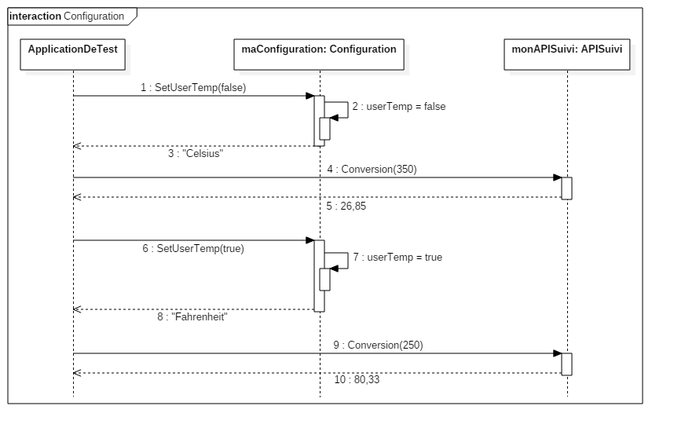
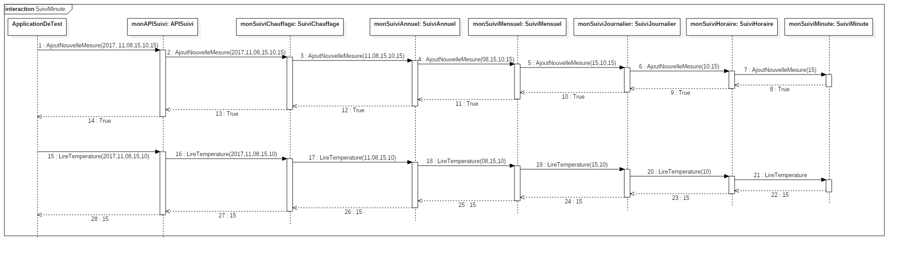
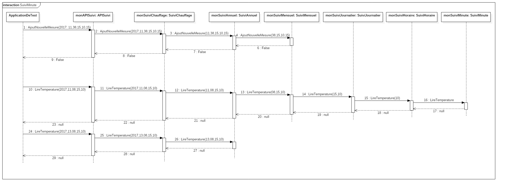
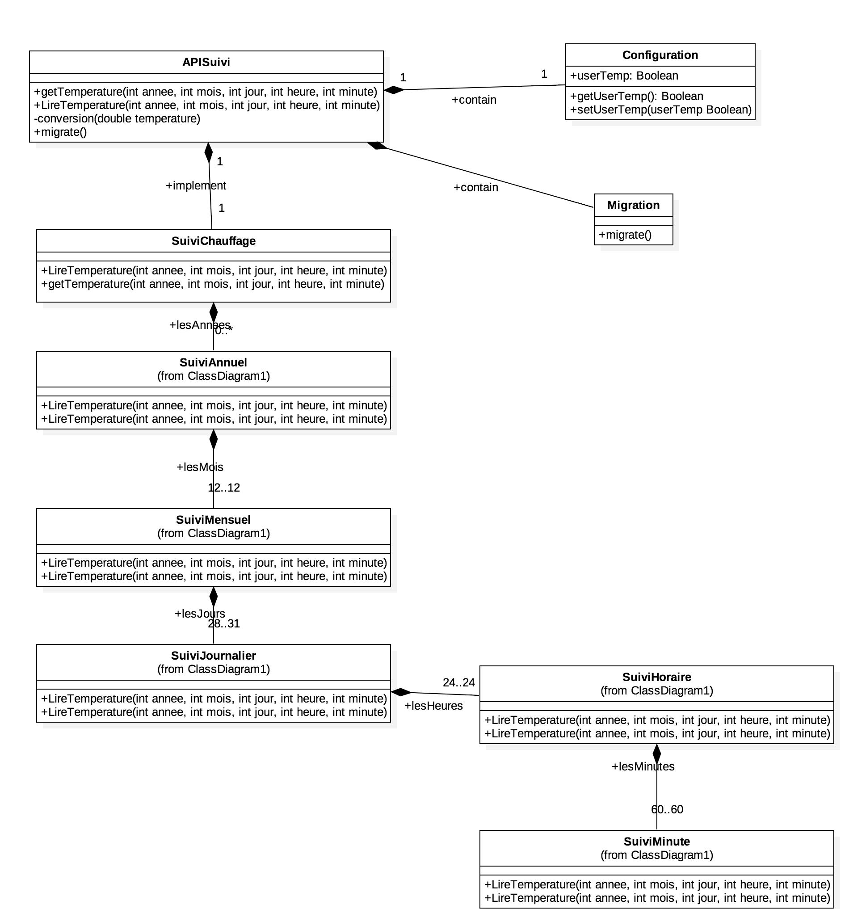

# Suivit et contrôle de température : Mise en oeuvre
## L'historique des températures mesurées

### Spécifications fonctionelles détaillées
#### E 3.1 : l'unité de température dépend du pays d'installation
Les calculs et la sauvegarde de température se font en Kelvin.  
L'unité d'affichage est choisie à l'installation, c'est degré Celsius (°C) Fahrenheit (°F).  
On peut modifier l'unité d'affichage de Celsius <-> Fahrenheit.  
A l'installation, le système demande à choisir le pays d'installation dans une liste déroulante des pays. Tous les pays sont en degré Celsius (°C) sauf aux Etats-Unis, au Bélize et aux Îles caïman  Fahrenheit (°F).  

Auteur : Quentin Lechat  
Relecteur : Guillaume Lamanda

#### E 3.2 : les donnees de suivi doivent etre serialisees
La sérialisation ici a deux aspects : 
- Sérialisation de l'état de l'objet
- Sérialisation des données

Sérialisation de l'état de l'objet :  
A l’arrêt de système, les états des données seront sauvegardés.  
Au démarrage de système on restaure l’état des données.  

Sérialisation des données :  
Les valeurs sont sérialisés dans un fichier au format CSV.  
- Entête : 
	- `annee ; mois ; jour ; heure ; minute ; temperature`
Les données sont mises à jour toutes les heures dans le fichier.  
Les données sont écrites dans l'ordre chronologique.  
Une méthode d'export sera disponible en cas de besoin de l'utilisateur.  
Les données seront présumés propre : Il n'es pas possible d'avoir deux valeurs pour une même heure. Il n'y a donc pas de doublons ou d'erreurs.  
Si aucunes température n'est disponible pour une certaine heure, les données ne sont pas écrite dans le fichier.

Auteur : Zakaria BELGHAZAL  
Relecteur : Guillaume LAMANDA  
Auteur 2 : Guillaume LAMANDA  
Relecteur 2 : Serge MEL  

#### E 3.3 : On doit pouvoir faire un suivi à la minute
Une heure contient 60 minutes.  
La température stockée est en Kelvin.  
On peut lire une mesure de température.  
On peut ajouter une nouvelle mesure pour une minute donnée.  
Une minute stocke une seule valeur.  
Il n'es pas possible de modifier une valeur précédemment ajouté.

Autheur : Guillaume LAMANDA   
Relecteur : Quentin LECHAT  

#### E 3.4 : On doit pouvoir faire migrer des données enregistrées par heure, dans des données à la minute
- Les heurees et les minutes stockent une température en Kelvin
- On peut dupliquer la valeur de température d'une heure dans 60 minutes

Autheur : Quentin LECHAT   
Relecteur : Serge MEL  

#### E 3.5 : On veut récuperer les températures moyennes par heure, par jour et par mois.
- Spécification fonctionnelle températues moyennes par heure :
  Il s'agit de récuperer les différentes valeurs mesurées par minute durant 60 minutes pour calculer la moyenne de température en 1 heure.
  
- Spécification fonctionnelle températues moyennes par jour  :
  Récupérer les différentes valeurs de températures mesurées chaque heure pendant 24 heures et faire la moyenne de mesures.
  
  
- Spécification fonctionnelle températues moyennes par mois  :
  Extraire les différentes valeurs de températures mesusées de chaque jour sur une période 30 jours et faire la moyenne.
  
Autheur : Serge MEL   
Relecteur : Guillaume LAMANDA  


### Spécification technique :
#### E 3.1 : l'unité de température dépend du pays d'installation
On ajoute la classe Configuration :
- Un attribut « userTemp » correspondant à l’unité de température en booléen. Le faux correspond au Celcius et le vrai correspond Fahrenheit (+ getter/setter),
Classe APISuivi : 
- Une méthode « LireTemperature », qui permet de récupérer la température en via la méthode existante « lireTempérature » de la classe SuiviChauffage puis la convertie via la méthode « conversion »,
- Une méthode AjoutNouvelleMesure qui reprend les paramètre de la classe SuiviTemperature.
- Une méthode « conversion » qui permet de convertir la valeur depuis le Kelvin à l’unité de destination choisi par l’utilisateur.  

Autheur : Guillaume Lamanda    
Relecteur : Serge Mel  

#### E 3.2 : les donnees de suivi doivent etre serialisees
Sérialisation de l'état de l'objet :  
On modifie la classe APISuivi pour qu'elle implémente la classe Serializable. Par héritage, la classe obtiendra un attribut privé serialVersionUID.  
On modifie le programme principale pour qu'au démarrage, il restaure l'objet APISuivi depuis le ficher "APISuivi.ser". Si le fichier n'existe pas, on creer une nouvelle instance de la classe APISuivi.  
A la fermeture du programme, le l'objet est écrit dans le fichier "APISuivi.ser".  

Sérialisation des données :  
Les données sont écrites dans un fichier `data.csv`.  
On ajoute un attribut `lastFlush` de type Date à la classe APISuivi. Il correspond à la dernière écriture dans le fichier.  
Une méthode writeData est ajouté à la classe APISuivi. Elle permet d'écrire les données qui n'ont pas encore été écrites dans le fichier. Elle vérifie pour chaque donnée à écrire si elle est bien différente de `null`.  
A chaque <b>ajout</b> de nouvelle mesure, on vérifie si le temps depuis la dernière écriture est supérieur à 1h. Si c'est le cas, on appelle la méthode `writeData`.  


Auteur : Guillaume LAMANDA	 
Relecteur : Quentin LECHAT  

#### E 3.3 : On doit pouvoir faire un suivi à la minute
On ajoute une classe SuiviMinutes :
- un attribut "temperatureMesuree" de type double qui stock la valeur de température de la minute
- une méthode AjoutNouvelleMesure qui prend en paramètre un double et qui va enregistrer la température
- une méthode LireTemperature qui renvoit la température enregistrée de type Double

On ajoute le paramètre entier "minute" pour les méthodes AjoutNouvelleMesure et LireTemperature des classes suivantes :
- SuiviHoraire
- SuiviJournalier
- SuiviMensuel 
- SuiviAnnuel
- SuiviChauffage
- APISuivi

On modifie la classe SuiviHoraire pour prendre en compte les minutes :
- ajout d'un paramètre liste "lesMinutes"
- modification du constructeur qui créé 60 objets SuviMinutes et les ajoute dans la liste

Autheur : Quentin LECHAT   
Relecteur : Guillaume LAMANDA

#### E 3.4 : On doit pouvoir faire migrer des données enregistrées par heure, dans des données à la minute
On ajoute une classe MigrationDonnees :
- migrationDonnees qui prend en paramètre un double et qui va enregistrer la température

Autheur   : Serge MEL  
Relecteur : Quentin LECHAT  

#### E 3.5 : On veut récuperer les températures moyennes par heure, par jour et par mois.
Non fait

### Plan de test :
#### E 3.1 : l'unité de température dépend du pays d'installation
Test N°1 : 

Intention de test : Ce test va permettre la bonne configuration de l'unité de température après la configuration du boitier. Pour cela on vérifie l'attribut booleen "userTemp". 

Procédure :

T1.1: 
#### Scénario nominal de Configuration:
- Initialiser la classe configuration
- Définir la température de l'utilisateur en Celcius
	- `C.setUserTemp(false);`
- Réccupérer la température utilisateur
	- Elle doit être égale à faux.
	- `C.getUserTemp()==false`
- Définir la température de l'utilisateur en Celcius
	- `C.setUserTemp(false);`
- Réccupérer la température utilisateur
	- Elle doit être égale à faux.
	- `C.getUserTemp()==false`
- Définir la température de l'utilisateur en Fahrenheit
	- `C.setUserTemp(True);`
- Réccupérer la température utilisateur
	- Elle doit être égale à True.
	- `C.getUserTemp()==True`
- Définir la température de l'utilisateur en Celcius
	- `C.setUserTemp(false);`
- Réccupérer la température utilisateur
	- Elle doit être égale à faux.
	- `C.getUserTemp()==false`
- Définir la température de l'utilisateur en Fahrenheit
	- `C.setUserTemp(True);`
- Réccupérer la température utilisateur
	- Elle doit être égale à True.
	- `C.getUserTemp()==True`
- Définir la température de l'utilisateur enen Fahrenheit
	- `C.setUserTemp(True);`
- Réccupérer la température utilisateur
	- Elle doit être égale à True.
	- `C.getUserTemp()==True`
- Définir la température de l'utilisateur en Fahrenheit
	- `C.setUserTemp(True);`
- Réccupérer la température utilisateur
	- Elle doit être égale à True.
	- `C.getUserTemp()==True`
	- Définir la température de l'utilisateur en Fahrenheit
	- `C.setUserTemp(True);`
- Réccupérer la température utilisateur
	- Elle doit être égale à True.
	- `C.getUserTemp()==True`


Test  | Valeur Attendu | Valeur Observé | Validation  
------|----------------|----------------|-----------
Celsius |    False |  |  
Celsius |    False |  |  
Fahrenheit |  True|    | 
Celsius |    False |  |  
Fahrenheit |  True|    | 
Fahrenheit |  True|    |  
Fahrenheit |  True|    | 
Fahrenheit |  True|    | 

#### Scénario nominal de Configuration:
T1.2:  
- Initialiser la classe configuration
	- `C=newConfiguration(UserTemp);`
- Définir la température de l'utilisateur en Fahrenheit
	- `C.setUserTemp(True);`
- Réccupérer la température utilisateur
	- Elle doit être égale à True.
	- `C.getUserTemp()==True`
- Définir la température de l'utilisateur en Fahrenheit
	- `C.setUserTemp(True);`
- Réccupérer la température utilisateur
	- Elle doit être égale à True.
	- `C.getUserTemp()==True`
- Définir la température de l'utilisateur en Celcius
	- `C.setUserTemp(faux);`
- Réccupérer la température utilisateur
	- Elle doit être égale à faux.
	- `C.getUserTemp()==faux`
- Définir la température de l'utilisateur en Celcius
	- `C.setUserTemp(false);`
- Réccupérer la température utilisateur
	- Elle doit être égale à faux.
	- `C.getUserTemp()==false`
- Définir la température de l'utilisateur en Fahrenheit
	- `C.setUserTemp(True);`
- Réccupérer la température utilisateur
	- Elle doit être égale à True.
	- `C.getUserTemp()==True`
- Définir la température de l'utilisateur enen Fahrenheit
	- `C.setUserTemp(True);`
- Réccupérer la température utilisateur
	- Elle doit être égale à True.
	- `C.getUserTemp()==True`
- Définir la température de l'utilisateur en Celcius
	- `C.setUserTemp(false);`
- Réccupérer la température utilisateur
	- Elle doit être égale à faux.
	- `C.getUserTemp()==True`
	- Définir la température de l'utilisateur en Fahrenheit
	- `C.setUserTemp(True);`
- Réccupérer la température utilisateur
	- Elle doit être égale à True.
	- `C.getUserTemp()==True`


Test  | Valeur Attendu | Valeur Observé | Validation  
------|----------------|----------------|-----------
Fahrenheit |  True|    | 
Fahrenheit |  True|    | 
Celsius |    False |  |  
Celsius |    False |  |  
Fahrenheit |  True|    | 
Fahrenheit |  True|    | 
Celsius |    False |  |  
Fahrenheit |  True|    | 

Auteur : Serge MEL  
Relecteur : Guillaume LAMANDA

#### E 3.2 : les donnees de suivi doivent etre serialisees
Test N°1 : 

Intention de test : Ce test va permettre la vérification de la serialisarion du fichier APISuivi.ser 

Procédure :
T1.1: 
- démarrer le programme sans que le fichier APISuivi.ser existe
- Ajouter de nouvelles mesures
	- AjoutNouvelleMesure( 2017, 03, 1, 12, 12 );
	- AjoutNouvelleMesure( 2017, 03, 1, 13, 12 );
	- AjoutNouvelleMesure( 2017, 03, 2, 12, 12 );
	- AjoutNouvelleMesure( 2017, 03, 2, 13, 12 );
- fermer le programme
- redémarrer le programme
- Accèder aux mesures 
	- LireTemperature( 2017, 03, 1, 12); 
		-	doit retourner 12.
	- LireTemperature( 2017, 03, 1, 13);
		- doit retourner 12.
- fermer le programme
- supprimer 'APISuivi.ser' 
- redémarrer le programme
- Accèder aux mesures 
	- LireTemperature( 2017, 03, 1, 12); 
		-	doit retourner null.
	- LireTemperature( 2017, 03, 1, 13);
		- doit retourner null.

| Test | Valeur attendu | Valeur observé | Validation
|------|---------------|-------------|----
| AjoutNouvelleMesure( 2017, 03, 1, 12, 12 ) | true |  |
| AjoutNouvelleMesure( 2017, 03, 1, 13, 12 ) | true |  |
| AjoutNouvelleMesure( 2017, 03, 2, 12, 12 ) | true |  |
| AjoutNouvelleMesure( 2017, 03, 2, 13, 12 ) | true |  |
| Fermer le programme 	| Sérialisation : 'APISuivi.ser' |  |
| LireTemperature( 2017, 03, 1, 12) | 12 |  |
| LireTemperature( 2017, 03, 1, 13) | 12 |  |
| Fermer le programme 	| Sérialisation : 'APISuivi.ser' |  |
| supprimer le fichier  | -  | - | - |
| LireTemperature( 2017, 03, 1, 12) | null |  |
| LireTemperature( 2017, 03, 1, 13) | null |  |

Auteur : Quentin LECHAT  
Relecteur : Guillaume LAMANDA

#### E 3.3 : On doit pouvoir faire un suivi à la minute
Test n°1
Intention de test : Vérifier qu'il est bien possible d'ajouter une nouvelle mesure dans une minute, et de la lire.

Procédure : 
- [ Init ]
- AjoutNouvelleMesure( 2017, 03, 1, 12, 59, 12 );
	- Doit retourner `true`
- AjoutNouvelleMesure( 2017, 03, 1, 13, 00, 13 );
	- Doit retourner `true`
- AjoutNouvelleMesure( 2017, 03, 2, 12, 15, 14 );
	- Doit retourner `true`
- AjoutNouvelleMesure( 2017, 03, 2, 13, 30, 15 );
	- Doit retourner `true`
- LireTemperature( 2017, 03, 1, 12, 59);
	- Doit retourner 12
- LireTemperature( 2017, 03, 1, 13, 00);
	- Doit retourner 13
- LireTemperature( 2017, 03, 1, 12, 15);
	- Doit retourner 14
- LireTemperature( 2017, 03, 1, 13, 30);
	- Doit retourner 15
- LireTemperature( 2017, 03, 6, 13, 30);
	- Valeur non ajoutée
	- Doit retourner null
- LireTemperature( 2017, 03, 6, 13, 62);
	- Valeur impossible
	- Doit retourner null

| Test | Valeur attendu | Valeur observé | Validation
|------|---------------|-------------|----
| AjoutNouvelleMesure( 2017, 03, 1, 12, 59, 12 ) | true |  |
| AjoutNouvelleMesure( 2017, 03, 1, 13, 00, 13 ) | true |  |
| AjoutNouvelleMesure( 2017, 03, 2, 12, 15, 14 ) | true |  |
| AjoutNouvelleMesure( 2017, 03, 2, 13, 30, 15 ) | true |  |
| LireTemperature( 2017, 03, 1, 12, 59) | 12 |  |
| LireTemperature( 2017, 03, 1, 13, 00) | 13 |  |
| LireTemperature( 2017, 03, 2, 12, 15) | 14 |  |
| LireTemperature( 2017, 03, 2, 13, 30) | 14 |  |
| LireTemperature( 2017, 03, 6, 13, 30 | null |  |
| LireTemperature( 2017, 03, 6, 13, 62) | null |  |

Auteur : Guillaume LAMANDA  
Relecteur : Quentin LECHAT

#### E 3.4 : On doit pouvoir faire migrer des données enregistrées par heure, dans des données à la minute

#### E 3.5 : On veut récuperer les températures moyennes par heure, par jour et par mois.

-------------------------

### Diagramme de séquence
#### E 3.1 : l'unité de température dépend du pays d'installation



#### E 3.2 : les donnees de suivi doivent etre serialisees
Non fait



#### E 3.3 : On doit pouvoir faire un suivi à la minute

#### E 3.4 : On doit pouvoir faire migrer des données enregistrées par heure, dans des données à la minute

#### E 3.5 : On veut récuperer les températures moyennes par heure, par jour et par mois.

--------------------------
### Diagramme de classe 



--------------------------

### Réalisation : 
#### E 3.1 : l'unité de température dépend du pays d'installation
```
public class APISuivi {

	public double lireTemperature(int annee, int mois, int jour, int heure,String unite) {
		double Temperature=new SuiviChauffage().LireTemperature(annee, mois, jour, heure);
		return conversion(Temperature,unite);
	}
	public double conversion(double temp,String unite) {
		double conv=temp;
		if(unite=="Celius")
			conv+=273.15;
		else if (unite=="Fahrenheit")
			conv= conv * 9/5 - 459.67;
		return conv;
	}
	
	public void AjoutNouvelleMesure(int annee, int mois, int jour, int heure,double uneTemperature) {
	
	}
}
```
*****************************************************************************************************************
```
public class Configuration {

	private boolean userTemp;
	public Configuration() {
		super();
	}
	public Configuration(boolean userTemp) {
		super();
		this.userTemp = userTemp;
	}
	public String type() {
		if (getUserTemp()== true) return "Celsius";
		else return "Fahrenheit";	
	}
	public boolean getUserTemp() {
		return userTemp;
	}
	public void setUserTemp(boolean userTemp) {
		this.userTemp = userTemp;
	}
}
```

Autheur : Zakaria BELGHAZAL  
Relecteur : Guillaume LAMANDA